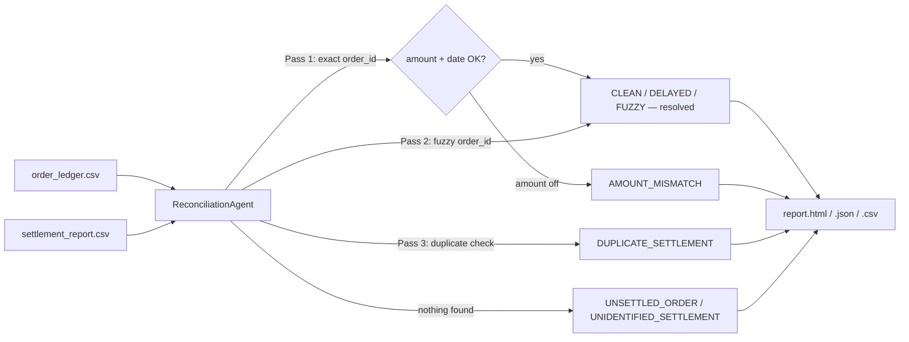

# ReconLoop — AI Finance Controller

**Razorpay AI Buildathon 2026 · Track 04: AI Finance Controller**

> Build an agent that closes one finance-ops loop across a 50+ record batch of synthetic data, reporting its match rate and the exceptions it could not resolve.

ReconLoop reconciles an internal **order ledger** against a payment gateway's **settlement report** — the "multi-source reconciliation" direction from the track brief, done as a real, runnable agent instead of a slide. It's a deterministic, multi-pass matching engine, not a black box: every match or exception traces back to a specific rule, and its accuracy is checked against a known answer key instead of a cherry-picked demo run.

## The 60-second version

- **116 records** (57 orders + 59 settlements) — comfortably over the 50+ bar — with seven real-world discrepancies deliberately baked in.
- Field names follow **Razorpay's own settlement vocabulary** (`order_id`, `payment_id`, `settlement_id`, `settlement_utr`, `fee`, `tax`, T+2 settlement cycle) so the batch reads like a real merchant's reconciliation job, not a generic toy dataset.
- The agent runs **3 matching passes** (exact reference → fuzzy reference → duplicate detection), logging its own reasoning at each step.
- Every single record ends up **matched** or **exception** — nothing is dropped, filtered, or hidden.
- Because the batch is synthetic, the right answer for every record is known in advance. `validator.py` grades the agent against that answer key *after* the fact — that's where "measured accuracy" comes from, instead of a claim.

**This run:** 82.46% order match rate · 79.66% settlement match rate · 22 exceptions (none hidden) · 100% accuracy against ground truth · 84,724 records/sec. Full detail in [`sample-output/report.html`](sample-output/report.html).

## Screenshots

### Reconciliation report — `output/report.html`

The static HTML report is the primary deliverable: everything a reviewer needs on one page, no setup required.

**Summary metrics & agent reasoning trail** — order match rate, settlement match rate, exception count, throughput, and accuracy-vs-ground-truth up top, followed by the agent's own 6-step reasoning log.

**
**

**Exceptions — order-side view** — every unresolved order, with its status (`AMOUNT_MISMATCH`, `UNSETTLED_ORDER`, etc.) and a plain-language note explaining why it couldn't be auto-matched.

**Image 2**

**Exceptions — settlement-side view** — the same exception list from the settlement side, including `UNIDENTIFIED_SETTLEMENT` and `DUPLICATE_SETTLEMENT` cases.

**Image 3**

### Test suite — 12/12 passing

Standard-library `unittest`, no dependencies required. Run with `python3 -m unittest discover tests -v`.

**Image 4**

### Interactive dashboard — `streamlit run app.py`

An optional Streamlit UI over the same underlying engine, for exploring results interactively instead of reading a static file.

**Overview & agent reasoning trail** — same headline metrics as the HTML report, live and re-runnable, including a seed control to regenerate the synthetic batch on demand.

**Image 5**

**Exceptions table** — sortable, scrollable view of all 22 exceptions with full notes.

**Image 6**

**Flagged matches & matched orders** — records that matched but are worth a second look (delayed settlements, fuzzy-reference matches), plus the full list of cleanly matched orders.

**Image 7**

## Why this design (and not "an LLM reconciles your books")

Finance reconciliation needs an audit trail, not a plausible-sounding answer. So the matching logic in `src/matcher.py` is **100% deterministic, rule-based Python** — every decision carries a specific reason, visible in that record's `notes` field. An LLM (Claude Haiku, optional, **off by default**) is used *only* to rewrite an already-decided exception's note into friendlier prose, via `--use-llm`. It never sees the raw ledger and never gets a vote on what counts as a match — see `src/explainer.py`. Skip the flag entirely and everything works identically, just with the rule-based note.

## Quick start

The core CLI needs **nothing beyond Python 3.9+**:

```bash
python3 main.py
```

First run generates the synthetic batch, reconciles it, validates it against ground truth, and writes:

- `output/report.html` — open this first, in any browser
- `output/reconciliation_report.json` — full structured report (summary + every record)
- `output/exceptions.csv` — flat exception list, opens directly in Excel/Sheets

Useful flags:

```bash
python3 main.py --regenerate        # fresh synthetic dataset, same categories
python3 main.py --seed 7            # a different dataset entirely
python3 main.py --use-llm           # narrate exceptions with Claude (needs ANTHROPIC_API_KEY)
python3 main.py --no-validate       # skip the ground-truth accuracy check
```

Optional interactive dashboard:

```bash
pip install -r requirements.txt
streamlit run app.py
```

Run the tests (standard library only, nothing to install):

```bash
python3 -m unittest discover tests -v
```

## How it works

```
data/order_ledger.csv ─────┐
                            ├──▶  ReconciliationAgent  ──▶  every record labeled:
data/settlement_report.csv ┘        Pass 1: exact order_id     CLEAN · DELAYED_SETTLEMENT ·
                                     Pass 2: fuzzy order_id     FUZZY_REFERENCE_MATCH   (resolved)
                                     Pass 3: duplicate check    AMOUNT_MISMATCH · UNSETTLED_ORDER ·
                                                                 UNIDENTIFIED_SETTLEMENT ·
                                                                 DUPLICATE_SETTLEMENT   (exception)
                                                    │
                                                    ▼
                                    output/report.html, .json, .csv
```



### The two data sources

| File | Represents | Key fields |
|---|---|---|
| `data/order_ledger.csv` | What Kestrel Living's internal system recorded when the customer paid | `order_id`, `order_amount`, `order_date` |
| `data/settlement_report.csv` | What the payment gateway actually settled to the bank | `order_id`, `gross_amount`, `fee`, `tax`, `settlement_utr`, `settled_at` |

`order_id` is the join key — exactly the reference a real Razorpay settlement report carries back to the merchant's own order.

### The seven scenarios baked into the batch (seed 2026)

| Scenario | Records | Resolved? | Why it happens in real life |
|---|---|---|---|
| Clean match | 34 orders | ✅ matched | reference, amount, and settlement window all agree |
| Delayed settlement | 6 orders | ✅ matched, flagged | settled outside the normal T+2–T+4 window |
| Fuzzy reference match | 4 orders | ✅ matched, flagged | `order_id` formatting drifted (legacy export truncation, char lookalikes) |
| Amount mismatch | 5 orders | ⚠️ exception | discount/refund applied on one side only |
| Unsettled order | 5 orders | ⚠️ exception | payment never settled, or failed silently |
| Unidentified settlement | 4 settlements | ⚠️ exception | money received with no matching order (e.g. stray payment link) |
| Duplicate settlement | 3 orders → 6 settlements | ⚠️ exception on the extra 3 | customer's payment was retried after a false failure |

*(Amount-mismatch pairs are flagged on both the order side and the settlement side, so they contribute 10 rows to the 22-row exception total, not 5 — a reviewer working from either file finds the issue.)*

### Matching passes — the agent's actual reasoning

1. **Exact reference match** — join on `order_id` exactly. Amount within ₹1 and settled within the normal window → clean. Amount within ₹1 but late → delayed (still matched). Amount outside ₹1 → held as an amount-mismatch exception, **not** force-matched.
2. **Fuzzy reference match** — for what's left, compare `order_id` strings with a similarity ratio (`difflib`, threshold 0.85); if it clears the bar and the amount agrees → matched, flagged for manual verification.
3. **Duplicate detection** — any settlement still unresolved that shares an `order_id` with an *already-matched* order is a duplicate payment, not a new one.
4. **Whatever's left is reported, not discarded** — orders with no settlement become `UNSETTLED_ORDER`; settlements with no order become `UNIDENTIFIED_SETTLEMENT`.

## Meeting "the bar"

> Throughput plus measured accuracy plus an honest exception list. One cherry-picked match proves nothing.

- **Throughput** — reported every run (84,724 records/sec, 0.0014s for this batch) — deterministic rule matching, not model inference, so it scales linearly and cheaply.
- **Measured accuracy** — `src/validator.py` grades every record against `data/ground_truth.json`, an answer key `src/matcher.py` never reads. 116/116 correct (100%) on this seed — a real number, not a claim.
- **Honest exception list** — every order and every settlement resolves to exactly one status. `total = matched + exceptions`, enforced by an assertion in `src/models.py`. Nothing is filtered before it reaches the report.

## Project structure

```
ReconLoop/
├── main.py                    # CLI entry point — zero dependencies
├── app.py                     # optional Streamlit dashboard
├── src/
│   ├── models.py                # LedgerOrder, SettlementRecord, Status enum (the one source of truth)
│   ├── data_generator.py        # synthetic batch + hidden ground truth
│   ├── data_loader.py           # CSV → dataclasses
│   ├── matcher.py                # ReconciliationAgent — the agent itself
│   ├── explainer.py              # rule-based notes / optional Claude narration
│   ├── report.py                  # JSON / CSV / HTML report writers
│   └── validator.py               # grades the agent against ground truth
├── data/                       # the checked-in demo dataset (seed 2026, reproducible)
├── sample-output/               # one real run's output, checked in as a static reference
├── tests/test_matcher.py       # unittest, standard library only
├── requirements.txt             # optional-only: streamlit, anthropic, python-dotenv
└── .streamlit/config.toml       # dashboard theme, matches report.html
```

## For the submission form

- **Selected Track:** Track 4: AI Finance Controller
- **Suggested Project Name:** ReconLoop
- **Project Objectives (draft — feel free to edit):** ReconLoop is a multi-source reconciliation agent that matches an internal order ledger against a payment gateway settlement report. It runs a deterministic, explainable multi-pass matching pipeline over a 116-record synthetic batch, reports a measured match rate validated against known ground truth (100% accuracy on the shipped seed), and produces a complete, categorized exception list for every record it couldn't auto-resolve — directly answering the track's ask to report match rate and exceptions without cherry-picking a good result.
- **Build Challenges (draft — swap in your real experience):** The trickiest part was deciding what "matched" should mean. A settlement that's simply late shouldn't sit in the same bucket as one with the wrong amount, but both start out as "not an exact clean match." I solved it by giving every record exactly one status from a fixed set (`src/models.py`), splitting "resolved but flagged" (delayed, fuzzy-reference) from "true exceptions" (amount mismatch, unsettled, unidentified, duplicate) — so the match-rate math and the exception list can never silently disagree with each other. I also had to walk back an early version of the synthetic "reference typo" generator: uppercasing the whole `order_id` changed too much of the string (similarity ratio ~0.5) to ever pass a sane fuzzy-match threshold, so I switched to smaller, more realistic drift (a dropped trailing character, a single lookalike-character swap) that a legacy export would actually produce.


## License

Harshit
